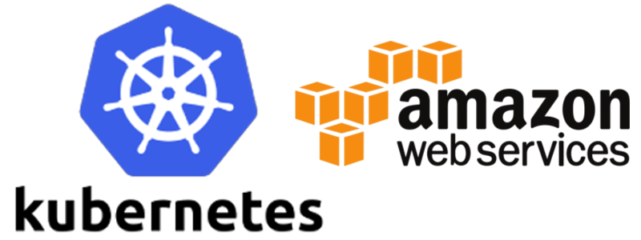

# Build, teardown and update k8s clusters (AWS)
reference: https://github.com/kubernetes/kops/tree/master/docs/cli

>
Note: ***An IAM user must be configured before creating clusters:
https://github.com/kubernetes/kops/blob/master/docs/aws.md#setup-iam-user***
>

>
Note: ***A DNS must be configured before creating clusters:
https://github.com/kubernetes/kops/blob/master/docs/aws.md#configure-dns***
>

>
Note: ***Under config folder you can find all the available clusters config templates, if you added new template or change existing one please do it before building the image and push the changes to git!***
>

>
Note: ***Under services folder you can find all the available services yml config file that will provision with the new cluster, you can add new service yml files before building the image!***
>

## AWS account prerequisites

* S3 bucket to store the clusters state
* ssh-keys folder in the bucket with ssh key pair named kops
* dashboards-password folder in the bucket

## User prerequisites
* kops : `brew install kops`
* awscli : `pip install --upgrade --user awscli`
* kubectl: `curl -LO https://storage.googleapis.com/kubernetes-release/release/$(curl -s https://storage.googleapis.com/kubernetes-release/release/stable.txt)/bin/darwin/amd64/kubectl && chmod +x ./kubectl && sudo mv ./kubectl /usr/local/bin/kubectl`

## Build
`docker build -t kops .`

## List existing clusters
`docker run --rm -e AWS_ACCESS_KEY_ID=<aws_access_key_id> -e AWS_SECRET_ACCESS_KEY=<aws_secret_access_key> -e AWS_REGION=<region> kops list <bucket>`

## Create a cluster
>
Note: ***Given empty template value, default template will be use.***
>

`docker run --rm -e AWS_ACCESS_KEY_ID=<aws_access_key_id> -e AWS_SECRET_ACCESS_KEY=<aws_secret_access_key> -e AWS_REGION=<region> kops create <cluster> <template> <bucket>`

>
Note: ***In order to ssh the instances, use the following keys: https://s3.amazonaws.com/bucket_state_store/ssh-keys/***
>

## Update cluster
***Run:***
`export KOPS_STATE_STORE=s3://bucket_state_store`

***commands to use for update:***
* Configure Kops to target cluster - `kops export kubecfg --name=<cluster_name>`
* To edit instancegroup use: `kops edit instancegroup <instancegroup_name>` (`kops get instancegroup` for instancegroups list)
* To edit main config use: `kops edit cluster`
* For update the cluser use: `kops update cluster --yes` (run without `--yes` flag - dry run)
* Run `kops rolling-update cluster --master-interval 6m --node-interval 6m --yes` ([-interval](https://github.com/kubernetes/kops/blob/master/docs/cli/kops_rolling-update_cluster.md#options) flags define for Kops what is the intervals between the instance restarts)

## Teardown a cluster
`docker run --rm -e AWS_ACCESS_KEY_ID=<aws_access_key_id> -e AWS_SECRET_ACCESS_KEY=<aws_secret_access_key> -e AWS_REGION=<region> kops teardown <cluster> <bucket>`

### Contributing

1. Create your feature branch: `git checkout -b my-new-feature`
2. Commit your changes: `git commit -am 'Add some feature'`
3. Push to the branch: `git push origin my-new-feature`
4. Submit a pull request :D

### Questions?

[Talk to me](mailto:ziv@devops.co.il)
